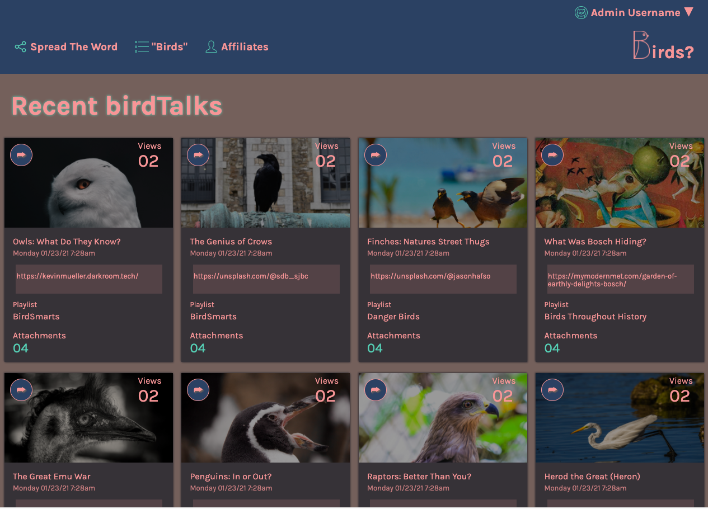
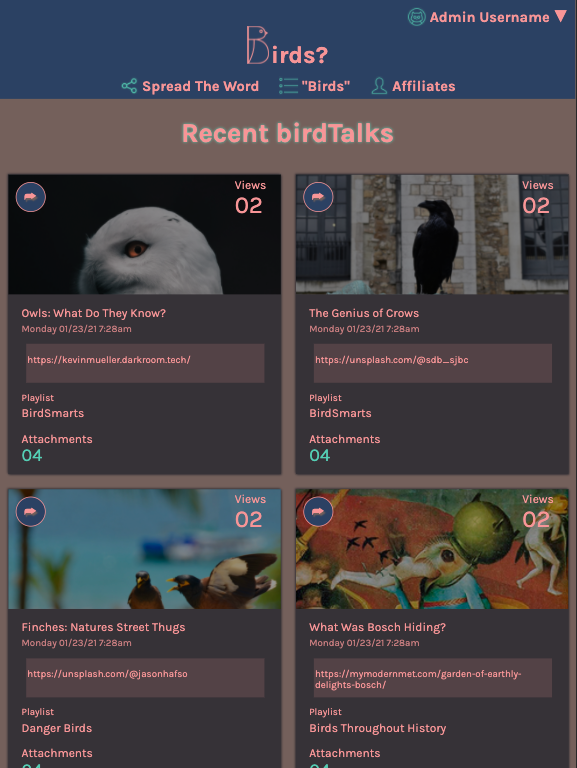
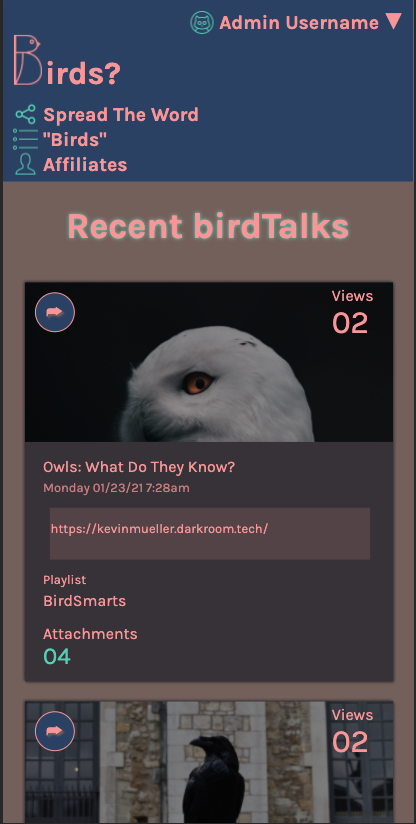

# Static Comp

## Contributors

* [Connor Anderson-Larson](https://github.com/ConnorAndersonLarson)

## Reviewers

* [Gabrielle Joyce](https://github.com/gaj23)

## Abstract

Birds? is a website for bird facts, conspiracies, and general information gathering. It was created as a static comp project with the requirements that one matches the framework of the provided comp (linked below) and the end product is responsive across a variety of different screen sizes. The final result is not dynamic, no Javascript has been implemented at this point. Color scheme was chosen to mesh well together, taken from southwest landscape color palettes with lighter accents to help tie in the brighter photos. Photos were taken from open source collections, photographer links are used as placeholder links in the site. Site was tested for full responsiveness across Chrome, Safari, and Firefox with breakpoints for mobile, tablets, and desktop (structure was set up as mobile-first). Logo designed by Connor Anderson-Larson and illustrated by [Krista Anderson-Larson](http://kristaandersonlarson.com/).

## Technologies Used:

* CSS
* HTML
* Normalize
* Wave

## Deploy Link:

* [Click here to open Birds?](https://connorandersonlarson.github.io/static-comp/)

## Initial Setup:

* Clone this repo and open `index.html` and `styles.css` in a text editor.
* As this is a static comp nothing should need to be installed to function.
* Site can be viewed/inspected by running `open index.html` in your terminal.

## Site Features

* Desktop View

* Tablet View

* Mobile View

* Original Comp

### Future Additions

* Improve site responsiveness
* Tweak card setup to be more dynamic with information inputted
